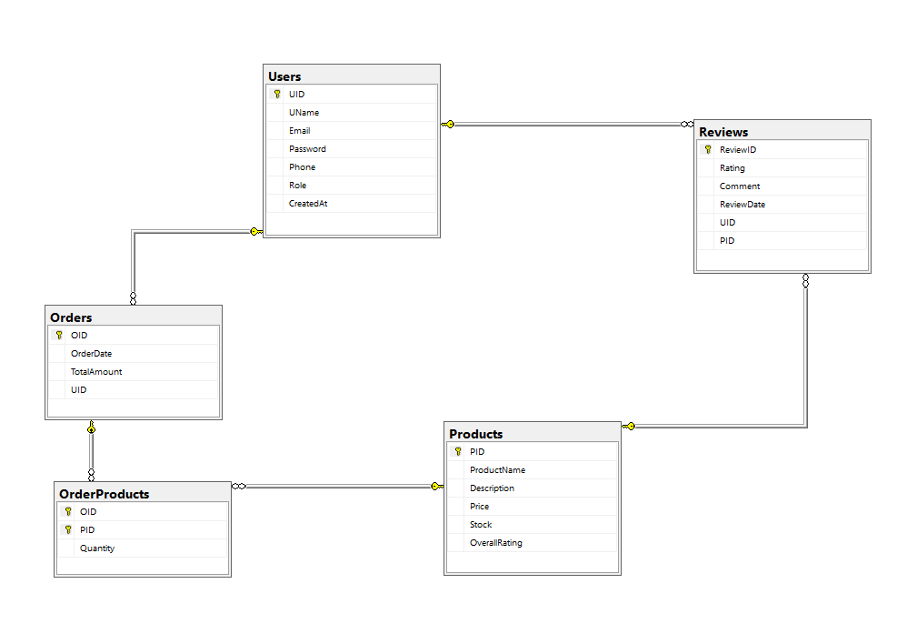

# E-Commerce System

## DB Schema

**System Diagram**

**[DB Schema File](./Schema/E-CommerceSystemSchema.sql)**

## System Structure

### Models

- **User**
```CSharp
    public class User
    {
        // Fields ...
        public int UID { get; set; }
        public string UName { get; set; }
        public string Email { get; set; }
        public string Password { get; set; }
        public string Phone {  get; set; }
        public string Role { get; set; }
        public DateTime CreatedAt { get; set; }
        //Navigation Properties ...
        public virtual ICollection<Order> Orders { get; set; }
        public virtual ICollection<Review> Reviews { get; set; }
    }
```
- **Order**
```CSharp
    public class Order
    {
        // Fields ...
        public int OID { get; set; }
        public int UID { get; set; } // Foreign Key to User Table ...
        public DateTime OrderDate { get; set; }
        public decimal TotalAmount { get; set; }
        //Navigation Properties ...
        public virtual User User { get; set; }
        public virtual ICollection<OrderProducts> OrderProducts { get; set; }
    }
```
- **Product**
```CSharp
    public class Product
    {
        // Fields ...
        public int PID { get; set; }
        public string ProductName { get; set; }
        public string Description { get; set; }
        public decimal Price { get; set; }
        public int Stock { get; set; }
        public decimal OverallRating { get; set; }
        //Navigation Properties ...
        public virtual ICollection<Review> Reviews { get; set; }
        public virtual ICollection<OrderProducts> OrderProducts { get; set; }
    }
```
- **Review**
```CSharp
    public class Review
    {
        // Fields ...
        public int ReviewID { get; set; }
        public int PID { get; set; } // Foreign Key to Product Table ...
        public int UID { get; set; } // Foreign Key to User Table ...
        public int Rating { get; set; }
        public string Comment { get; set; }
        public DateTime ReviewDate { get; set; }
        //Navigation Properties ...
        public virtual Product Product { get; set; }
        public virtual User User { get; set; }
    }
```
- **OrderProducts**
```CSharp
    public class OrderProducts
    {
        // Fields ...
        public int OID { get; set; } // Foreign Key to Order Table ...
        public int PID { get; set; } // Foreign Key to Product Table ...
        public int Quantity { get; set; }
        //Navigation Properties ...
        public virtual Order Order { get; set; }
        public virtual Product Product { get; set; }
    }
```

~~NOTE:~~ Every model class includes necessary data annotations for validation and relationships.

### DbContext

```CSharp
        public ApplicationDbContext(DbContextOptions<ApplicationDbContext> options) : base(options)
        {
        }

        public DbSet<User> Users { get; set; }
        public DbSet<Product> Products { get; set; }
        public DbSet<Order> Orders { get; set; }
        public DbSet<OrderProducts> OrderProducts { get; set; }
        public DbSet<Review> Reviews { get; set; }

        protected override void OnModelCreating(ModelBuilder modelBuilder)
        {
            modelBuilder.Entity<User>()
                        .HasIndex(u => u.Email)
                        .IsUnique();
        }
```
### Repositories

- **UserRepository**

- **ProductRepo**

  It contain the following custom methods:
  - void AddProduct(Product product)
  - IEnumerable<Product> GetAllProducts()
  - Product GetProductById(int pid)
  - void UpdateProduct(Product product)
  - Product GetProductByName(string productName)
  
  It implement the following interface:
  - IProductRepo

- **OrderRepository**

- **ReviewRepo**

  It contain the following custom methods:
  - void AddReview(Review review)
  - void DeleteReview(int rid)
  - IEnumerable<Review> GetAllReviews()
  - Review GetReviewById(int rid)
  - void UpdateReview(Review review)
  - Review GetReviewsByProductIdAndUserId(int pid, int uid)
  - IEnumerable<Review> GetReviewByProductId(int pid)
  
  It implement the following interface:
  - IReviewRepo
  
- **OrderProductsRepo**

  It contain the following custom methods:
  - void AddOrderProducts(OrderProducts product)
  - IEnumerable<OrderProducts> GetAllOrders()
  - List<OrderProducts> GetOrdersByOrderId(int oid)
  
  It implement the following interface:
  - IOrderProductsRepo

### Services
- **UserService**

- **ProductService**

  It contain the following custom methods:
  - void AddProduct(Product product)
  - IEnumerable<Product> GetAllProducts(int pageNumber, int pageSize, string? name = null, decimal? minPrice = null, decimal? maxPrice = null)
  - Product GetProductById(int pid)
  - void UpdateProduct(Product product)
  - Product GetProductByName(string productName)
  
  It implement the following interface:
  - IProductService

- **OrderService**

- **ReviewService**

  It contain the following custom methods:
  - void AddReview(int uid, int pid, ReviewDTO reviewDTO)
  - void DeleteReview(int rid)
  - IEnumerable<Review> GetAllReviews(int pageNumber, int pageSize, int pid)
  - Review GetReviewById(int rid)
  - IEnumerable<Review> GetReviewByProductId(int pid)
  - Review GetReviewsByProductIdAndUserId(int pid, int uid)
  - void UpdateReview(int rid, ReviewDTO reviewDTO)
  
  It implement the following interface:
  - IReviewService
  
- **OrderProductsService**

  It contain the following custom methods:
  - void AddOrderProducts(OrderProducts product)
  - IEnumerable<OrderProducts> GetAllOrders()
  - List<OrderProducts> GetOrdersByOrderId(int oid)
  
  It implement the following interface:
  - IOrderProductsService

### Controllers

- **UserController**

- **ProductController**

  It contain the following custom endpoints:
  - [HttpPost] /api/Product/AddProduct
  - [HttpPut] /api/Product/UpdateProduct/{productId}
  - [HttpGet] /api/Product/GetAllProducts
  - [HttpGet] /api/Product/GetProductByID/{ProductId}
  ~~NOTE:~~ This controller uses [Authorize] attribute to secure endpoints for all users except GetAllProducts and GetProductByID.
  
- **OrderController**

- **ReviewController**

  It contain the following custom endpoints:
  - [HttpPost] /api/Review/AddReview
  - [HttpGet] /api/Review/GetAllReviews
  - [HttpDelete] /api/Review/DeleteReview/{ReviewId}
  - [HttpPut] /api/Review/UpdateReview/{ReviewId}
  ~~NOTE:~~ This controller uses [Authorize] attribute to secure endpoints for all users except GetAllReviews.


## System Features

### User Features

### Product Features

1. **Add Product**: Admins can add new products to the system.
2. **Update Product**: Admins can update existing product details.
3. **View Products**: All users can view a list of products.
4. **Search for Product by ID**: Users can search for products by id.
5. **Search for Product by Name**: Users can search for products by name.

### Order Features

### Review Features

1. **Add Review**: Authenticated users can add reviews for products they have purchased.
2. **View Reviews on Product**: All users can view reviews for product.
3. **Update Review**: Users can update their own reviews.
4. **Delete Review**: Users can delete their own reviews.
5. **View All Reviews**: All users can view reviews for products.
